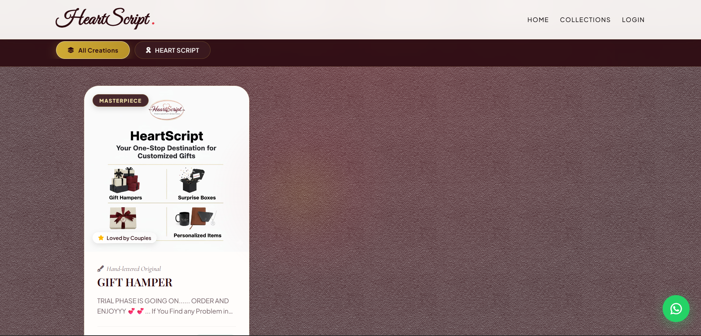
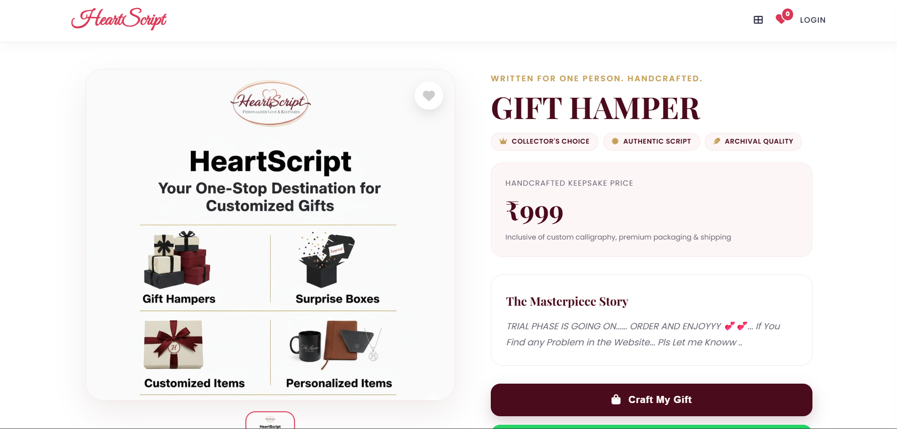
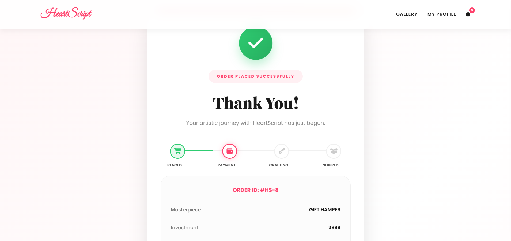
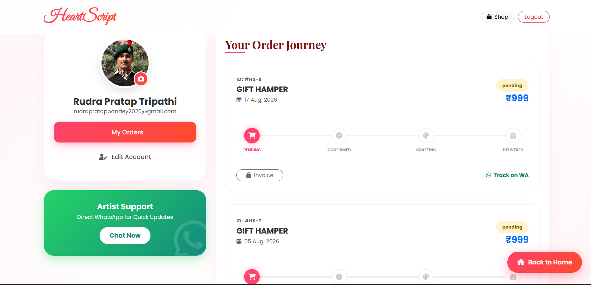
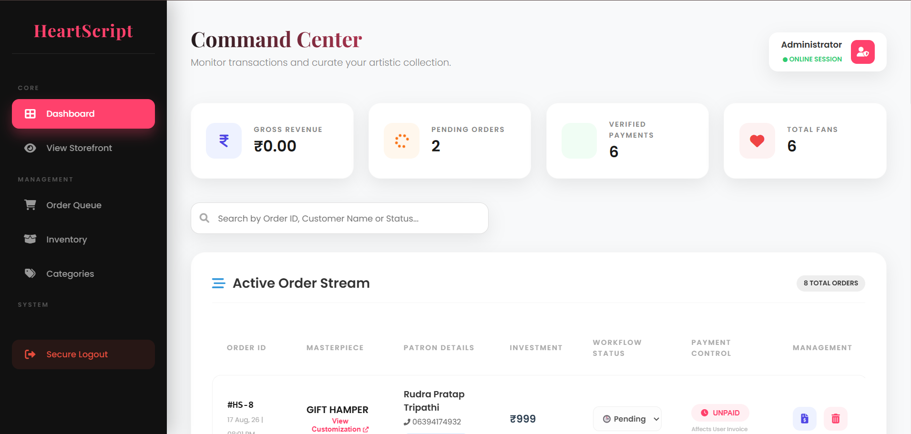
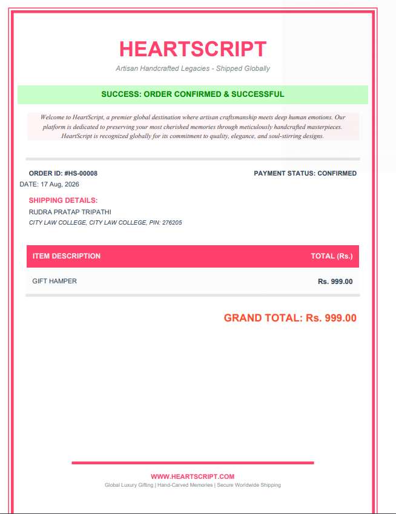

# ❤️ HeartScript

### The Art of Handwritten Emotions — A Full-Stack E-Commerce Platform for Meaningful, Handcrafted Gifts

> *"In a world of digital noise, we preserve the soul of your most cherished messages through the timeless elegance of ink."*

HeartScript is a full-stack e-commerce web application built for a boutique calligraphy studio, letting customers discover and order personalized, handwritten and handcrafted gifts. The platform covers the complete shopping journey — product browsing, authentication, product details, checkout, order tracking, profile management, password recovery — backed by a secure administrative dashboard for managing products, orders, and customers.

🔗 **Live Demo:** [heartscript025.pythonanywhere.com](https://heartscript025.pythonanywhere.com/)
📦 **Repository:** [github.com/rudrapratap0707/CODESOFT-HEARTSCRIPT](https://github.com/rudrapratap0707/CODESOFT-HEARTSCRIPT)

---

## 📖 About

HeartScript was built as a sanctuary for people who cherish the old-school charm of handwritten letters, customized journals, and artistic scripts. The platform blends craftsmanship with a full engineering stack — every order is backed by secure checkout, backend-verified pricing, real order tracking, and downloadable invoices, so the "human touch" of the product is matched by a trustworthy, production-grade shopping experience.

---

## 🌟 Features

### 👤 User Features
- User registration and login
- Secure password hashing
- Firebase authentication support
- Persistent login sessions via Flask-Login
- Profile management with profile picture upload
- Address and contact management
- Forgot-password flow with email OTP verification
- Password reset with security-question support

### 🛍️ Shopping Features
- Product catalogue with categories and filtering
- Detailed product pages with image gallery and related products
- Quantity selection and secure checkout
- Backend-controlled, tamper-proof pricing

### 📦 Order Management
- Order creation and tracking
- Order status and payment confirmation workflow
- Customer order history
- WhatsApp-based order/payment communication
- Downloadable PDF invoices
- Order ownership authorization

### 🛡️ Admin Dashboard
- Secure admin login
- Customer and order management
- Product and category management (add/update/delete)
- Order status updates and payment confirmation
- Firebase order synchronization

### 🔐 Security
- Password hashing & CSRF protection
- Login-required and role-based (admin) route protection
- File upload validation and image integrity checks
- Secure filename handling and upload size limits
- Backend-side price calculation (never trusts client input)
- OTP expiration and attempt limiting
- Environment-variable based secret management

---

## 🧰 Technology Stack

| Layer | Technologies |
|---|---|
| **Backend** | Python, Flask, Flask-SQLAlchemy, Flask-Login, Flask-Mail, Flask-WTF, Flask-CORS, Flask-JWT-Extended |
| **Database** | SQLite (local dev), PostgreSQL-compatible via SQLAlchemy, Firebase Firestore (cloud sync) |
| **Authentication** | Flask-Login, Firebase Authentication, hashed passwords, email OTP recovery |
| **Frontend** | HTML5, CSS3, JavaScript, Jinja2 Templates |
| **Other** | Firebase Admin SDK, Pillow, FPDF, Gunicorn, python-dotenv, REST-style JSON endpoints |
| **Deployment** | PythonAnywhere |

---

## 🏗️ Project Structure

```text
HEARTSCRIPT/
│
└── heartscript_backup/
    ├── app.py
    ├── requirements.txt
    ├── .gitignore
    │
    ├── templates/
    │   ├── index.html
    │   ├── shop.html
    │   ├── product_view.html
    │   ├── checkout.html
    │   ├── register.html
    │   ├── user_login.html
    │   ├── forgot_password.html
    │   ├── verify_otp.html
    │   ├── reset_password.html
    │   ├── profile.html
    │   ├── thank_you.html
    │   ├── admin.html
    │   ├── admin_user_detail.html
    │   └── login.html
    │
    └── static/
        └── uploads/            # product & profile images
```

---

## ⚙️ Installation & Setup

### 1. Clone the repository
```bash
git clone https://github.com/rudrapratap0707/CODESOFT-HEARTSCRIPT.git
cd CODESOFT-HEARTSCRIPT
```

### 2. Create a virtual environment
**Windows**
```bash
python -m venv venv
venv\Scripts\activate
```
**Linux / macOS**
```bash
python3 -m venv venv
source venv/bin/activate
```

### 3. Install dependencies
```bash
pip install -r requirements.txt
```

### 4. Configure environment variables
Create a `.env` file in the project root:
```env
SECRET_KEY=your_secret_key

DATABASE_URL=sqlite:///heartscript_v2.db

MAIL_SERVER=smtp.gmail.com
MAIL_PORT=587
MAIL_USE_TLS=true
MAIL_USERNAME=your_email@example.com
MAIL_PASSWORD=your_email_app_password

WHATSAPP_PHONE=your_whatsapp_number

ADMIN_EMAIL=admin@heartscript.com
ADMIN_PASSWORD_HASH=your_password_hash

FIREBASE_LOCAL_KEY=google-key.json
```
> ⚠️ Never commit `.env` or Firebase service-account credentials to GitHub.

### 5. Run the application
```bash
python app.py
```
The app will be available at `http://127.0.0.1:5000`

---

## 🛒 Application Flow

```text
Home → Shop → Product Details → Login / Registration → Checkout
     → Order Creation → Thank You Page → WhatsApp Payment Communication
     → Admin Payment Confirmation → Order Processing → Invoice Generation
```

## 🔐 Authentication Flow

```text
Registration → Password Hashing → Database Storage → Login → Flask-Login Session
```
Firebase Authentication is also supported for users who sign in via Firebase.

## 📦 Order Processing

The checkout system never trusts the price sent by the frontend. Instead, the backend:

1. Validates the product ID
2. Retrieves the product from the database
3. Validates the requested quantity
4. Calculates the total using the database price
5. Creates and stores the order
6. Synchronizes the order to Firebase (when available)
7. Returns the generated order ID

This prevents client-side price manipulation.

## 📄 Invoice Generation

Every order gets a downloadable PDF invoice with:
Order ID • Order date • Customer & shipping info • Ordered items • Payment status • Total amount • Brand details

## ☁️ Cloud Integration

Firebase powers user and order synchronization, Firebase Authentication, and Firestore data storage — while the app continues to run fully on local SQLite when Firebase credentials aren't configured.

---

## 🖥️ Screenshots

> Add screenshots to a `screenshots/` folder in the project root, then reference them below.

| | |
|---|---|
| **Home Page** |  |
| **Shop / Collection** |  |
| **Product Details** |  |
| **Checkout** |  |
| **Order Confirmation** |  |
| **User Profile** |  |
| **Admin Dashboard** |  |
| **Invoice** |  |

*(Never include Gmail/Firebase credentials, `.env` contents, API keys, or admin passwords in screenshots.)*

---

## 🎯 Project Overview

| | |
|---|---|
| **Project** | HeartScript |
| **Type** | Full-Stack E-Commerce Web Application |
| **Live Demo** | [heartscript025.pythonanywhere.com](https://heartscript025.pythonanywhere.com/) |
| **Repository** | [CODESOFT-HEARTSCRIPT](https://github.com/rudrapratap0707/CODESOFT-HEARTSCRIPT) |
| **Developer** | Rudra Pratap Tripathi |
| **Technology** | Python, Flask, SQLAlchemy, Firebase, HTML, CSS, JavaScript |

**Project Description**

> HeartScript is a full-stack e-commerce web application built using Python Flask, SQLAlchemy, Firebase, HTML, CSS, and JavaScript. The platform provides user authentication, product browsing, category filtering, product details, secure checkout, order management, WhatsApp payment communication, PDF invoice generation, and an administrative dashboard. It also implements security features including password hashing, CSRF protection, role-based admin authorization, input validation, secure file uploads, OTP-based password recovery, and backend-controlled order pricing.

---

## 👥 The Team

| | |
|---|---|
| **Rudra Pratap Tripathi** | Founder & Lead Artist / Full-Stack Developer |
| **Priyanshu Singh** | Creative Strategist |
| **Ravi Prajapati** | Error Handling Expert |
| **Palak Rai** | Art & Craft System Manager |

---

## 📬 Contact & Support

- **Location:** BBD Lucknow – 226028
- **Email:** heartscript025@gmail.com
- **Phone / WhatsApp:** +91 6394174932

**Policies:** 7-day replacement guarantee on damaged products (unboxing video required within 24 hours) • 2–4 day preparation + 5–7 day shipping across India • Minimal-data privacy policy — personal letters and details are never shared.

---

## 📜 License

This project is open for personal and educational reference.

---

<p align="center">Crafted with ❤️, Scripted for You.</p>